===============================
XESS Footprint Wizard
===============================

This is a wizard to assist you in making footprints for chips having pins around the 
edges (SOICs, QFPs, etc.) and ball grid arrays (BGAs)

* Free software: MIT license

Features
----------

* Generates footprints for SMD chips like SOICs, SSOPs, TSSOPs, QFPs, etc.
* Generates footprints for BGAs.
* Generates footprints for through-hole DIPs.
* Supports extending the pads to make hand-soldering or probing easier.
* Supports the addition of thermal pads.
* Silkscreen outlines can be resized along with the addition of beveling and indexes for orienting the chip on the PCB.

============
Installation
============

Just copy `xess_fp_wizard.py` to the `kicad/kicad/bin/scripting/plugins` directory.

========
Usage
========

There are two XESS footprint wizards: one for chips having pins around the edges (SOICs, QFPs, etc.),
and another for chips with pins spread over an area (i.e., BGAs).

You can make things like QFPs ...

.. image:: pics/qfp44.png

or SOICs, SSOPs TSSOPs (even with thermal pads)...

.. image:: pics/ssop28.png

or slightly odder stuff like resistor networks ...

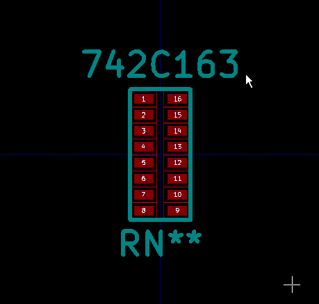

or create BGA footprints ...

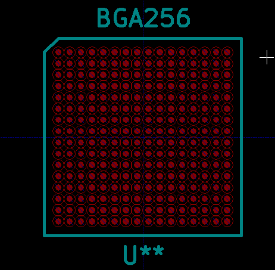

or even make footprints for old through-hole components.

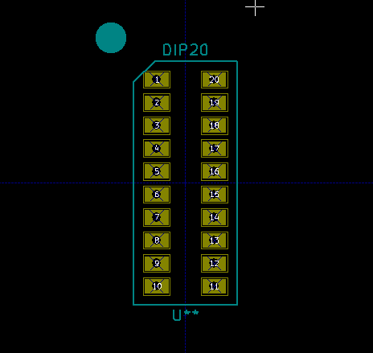

Making Footprints for Chips with Edge Pins
-----------------------------------------------------

Open the **Footprint Editor** and then click on the **New footprint using wizard** button.
Select the **Edge-Pin Chips** in the **Footprint Wizards** window as shown below:

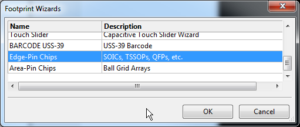

The **Footprint Wizard [Edge-Pin Chips]** window will appear.
Four panes are used to describe the footprint:

**Package**
  Specifies the package-wide parameters such as the overall chip dimensions and the number of pins.
  
**Pad**
  Specifies the characteristics of the package's individual pins.
  
**Paddle**
  Specifies the location and dimensions of the package's thermal paddle (if it has one).
  
**Misc**
  Specifies parameters that don't fit in any of the other panes.
  
The fields in each pane will now be described.

Package Pane
___________________________________

**#Pads (Horizontal)**
  Specifies the number of pins along the top and bottom edges of the chip.
  This number will be non-zero for quad flat pack chips (QFPs) and
  zero for chips like SOICs, TSSOPs, etc.

**#Pads (Vertical)**
  Specifies the number of pins along the left and right edges of the chip.

**Total Width (D) and Total Height (E)**
  These are the distances from the tip of the pin on the left or top edge to
  the tip of the pin on the opposite edge.
  These distances are usually found on a mechanical drawing of the chip package.

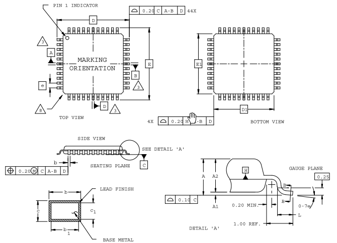

**Body Width (D1) and Body Height (E1)**
  These are the dimensions of the body that encapsulates the semiconductor IC.
  
**Left-to-Right Column Pitch and Top-to-Bottom Row Pitch**
  These are the distances from the centroid of the pins on the left or top edges to
  to the centroid on the opposite edge.
  These dimensions are usually found on a land-pattern drawing of the chip's
  recommended PCB footprint.
  
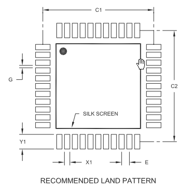

Pad Pane
___________________________________

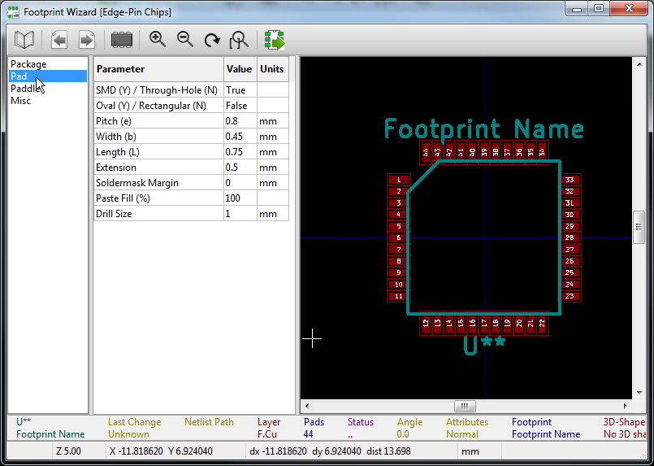

**SMD (Y) / Through-Hole (N)**
  Setting this Boolean flag to YES (True) will generate surface-mount pads for each pin.
  Setting it to NO (False) will generate through-hole pins.
  
**Oval (Y) / Rectangular (N)**
  Setting this Boolean flag to YES (True) will generate oval pads for each pin.
  Setting it to NO (False) will generate rectangular pads for each pin.
  
**Pitch (e)**
  This specifies the distance between adjacent pins in a row or column.
  
**Width (b) and Length (L)**
  This specifies width and length of the copper area of each pad.
  
**Extension**
  This specifies the length of an additional segment that will be added to the length of each pad.
  This can be used to provide a longer pad that makes soldering or probing easier.
  
**Soldermask Margin**
  This specifies an additional amount of clearance between the edge of the copper pad
  and the start of the soldermask surrounding the pad.
  
**Paste Fill (%)**
  This specifies the size of the aperture through which solder paste is applied to the pad.
  Usually, this should be left at 100%. Using a smaller value will decrease the amount
  of solder paste that will attach the IC pin to the PCB.
  
**Drill Size**
  This specifies the drill size for each through-hole pin.

Paddle Pane
___________________________________

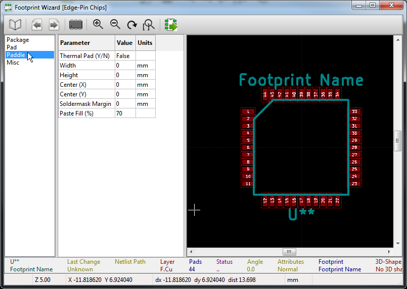

**Thermal Pad**
  Setting this Boolean flag to YES (True) will create a copper pad which is usually used to remove heat from the chip.
  No thermal paddle will be created if this flag is set to NO (False).
  
**Width and Height**
  These specify the size of the paddle.
  
**Center (X) and Center (Y)**
  These specify the position of the paddle's centroid.
  
**Soldermask Margin**
  This specifies an additional amount of clearance between the edge of the copper paddle
  and the start of the soldermask surrounding the pad.
  
**Paste Fill (%)**
  This specifies the size of the aperture through which solder paste is applied to the paddle.
  A common value for this is 70%. Using a smaller value will decrease the amount
  of solder paste that will attach the paddle to the PCB.

Misc Pane
___________________________________

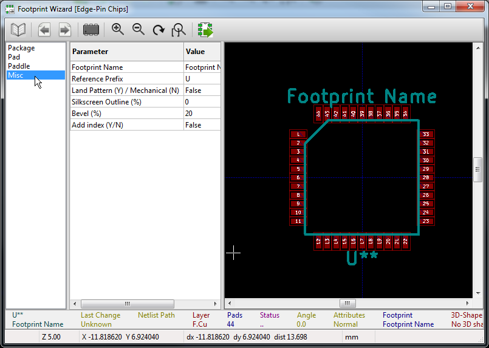

**Footprint Name**
  The name of the footprint is entered in this field.
  
**Reference Prefix**
  The beginning prefix for instances of chips that use this package is entered here.
  ('U' is the usual prefix for ICs.)
  
**Land Pattern (Y) / Mechanical (N)**
  Set this Boolean flag to YES (True) if you are using a land pattern to specify the distance between 
  the centroids of the pads.
  Set this to NO (False) if you are using a mechanical drawing that shows the dimension between the tips of
  pins on opposite sides of the chip.
  
**Silkscreen Outline (%)**
  The size of the chip boundary on the silkscreen is specified using this field.
  A value of 0% places the boundary within the inside of the pads.
  A value of 100% places the boundary around the outside of the pads.
  Values greater than 100% and less than 0% can be used to provide additional space between the boundary
  and the pads.
  
**Bevel (%)**
  The value in this field specifies the percentage of the top and left edges that will be
  "rounded-off" to create an index for pin 1.
  
**Add Index (Y/N)**
  Setting this Boolean flag to YES (True) will generate a small circle on the silkscreen
  to index the location of pin 1.
  No index will be created if this flag is set to NO (False).

Making BGA Footprints
----------------------------------------

Open the **Footprint Editor** and then click on the **New footprint using wizard** button.
Select the **Area-Pin Chips** in the **Footprint Wizards** window as shown below:

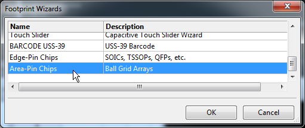

The **Footprint Wizard [Area-Pin Chips]** window will appear.
Three panes are used to describe the footprint:

**Package**
  Specifies the package-wide parameters such as the overall chip dimensions and the number of pins.
  
**Pad**
  Specifies the characteristics of the package's individual pins.
  
**Misc**
  Specifies parameters that don't fit in any of the other panes.
  
The fields in each pane will now be described.

Package Pane
___________________________________

**#Cols (Horizontal)**
  Specifies the number of columns of pads.

**#Rows (Vertical)**
  Specifies the number of rows of pads.

**Width (D) and Height (E)**
  These are the width and height of the BGA package body.

Pad Pane
___________________________________

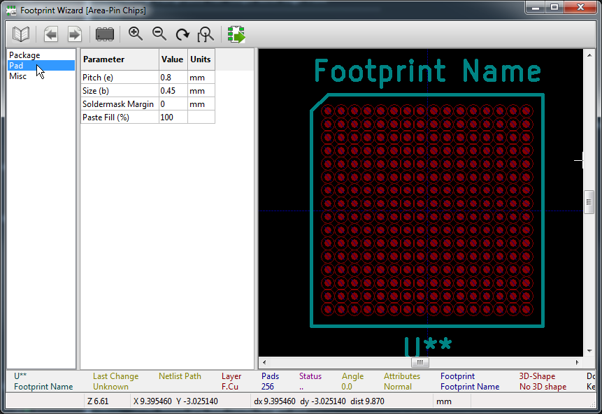

**Pitch (e)**
  This specifies the distance between adjacent pins in a row or column.
  
**Size (b)**
  This specifies the diameter of each copper pad.
  
**Soldermask Margin**
  This specifies an additional amount of clearance between the edge of the copper pad
  and the start of the soldermask surrounding the pad.
  
**Paste Fill (%)**
  This specifies the size of the aperture through which solder paste is applied to the pad.
  Usually, this should be left at 100%. Using a smaller value will decrease the amount
  of solder paste that will attach the IC pin to the PCB.
  

Misc Pane
___________________________________

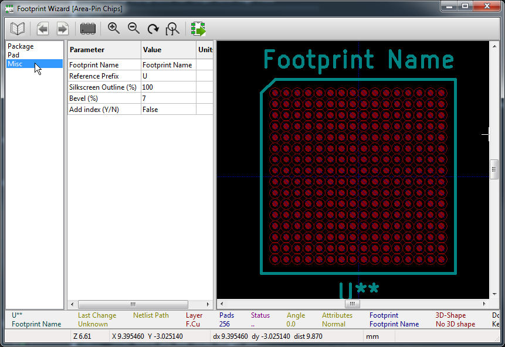

**Footprint Name**
  The name of the footprint is entered in this field.
  
**Reference Prefix**
  The beginning prefix for instances of chips that use this package is entered here.
  ('U' is the usual prefix for ICs.)
  
**Silkscreen Outline (%)**
  The size of the chip boundary on the silkscreen is specified using this field.
  A value of 100% fits the boundary to the package body dimensions.
  Values greater than 100% can be used to provide additional space between the boundary
  and the package body.
  Values less than 100% are usually not useful as the silkscreen would be printed
  over the pads.
  
**Bevel (%)**
  The value in this field specifies the percentage of the top and left edges that will be
  "rounded-off" to create an index for pin 1.
  
**Add Index (Y/N)**
  Setting this Boolean flag to YES (True) will generate a small circle on the silkscreen
  to index the location of pin A1.
  No index will be created if this flag is set to NO (False).

=======
Credits
=======

Development Lead
----------------

* XESS Corp. <info@xess.com>

Contributors
------------

None yet. Why not be the first?

========
History
========

0.1.0 (2015-09-01)
---------------------

* First release.
